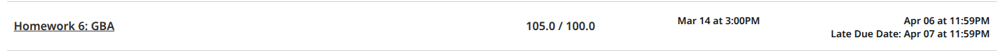

# THE HARDEST GAME IN THE WORLD

Author: Thinh Minh Nguyen - tnguyen831@gatech.edu

Version: 1.0


## Highlights:

### How to play:
Simple, just move the blue square from the left green area to the right green area while avoiding hit by the red squares

### Controls: 
- UP $\uparrow$: go up
- DOWN $\downarrow$: go down
- RIGHT $\rightarrow$: go right
- LEFT $\leftarrow$: go left
- ENTER: adjust game's difficulty
- BACKSPACE: back to main screen and reset difficulty

## Overview:
This is a game in Game Boy Advance (GBA) style that I made as a submission to Homework 6 - CS 2110 at Georgia Tech. This is my most-favorite project of the class where I got 105/100 points, so I decided to publish it here on GitHub!



## Usage Instructions:
1. You need a Docker image to run the game, thus you should have Docker installed on your computer ([link to install Docker](https://docs.docker.com/desktop/setup/install/mac-install/))

2. Pull down the ```gtcs2110/cs2110docker``` by running the following terminal command (have Docker running in background):

```
./cs2110docker-gba.sh
```

3. Enjoy the game:

```
make mgba
```
